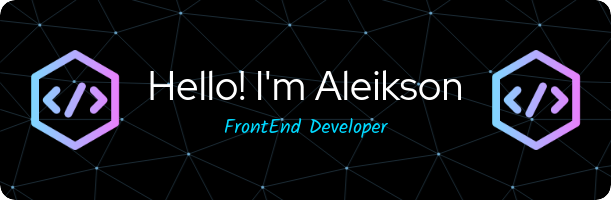

  

  

<em>"The problem is not the problem. The problem is your attitude about the problem. Do you understand?" – Pirates of the Caribbean</em>

📚 I'm currently learning:

  
  
  
  
  

   

- 📩 How to reach me: <a href="mailto:aleiksonsilva@hotmail.com">_aleiksonsilva@hotmail.com_</a>

- 🌐 Connect with me on LinkedIn: [linkedin.com/aleikson](https://www.linkedin.com/in/aleikson-frontend/)

- 💬 Connect with me on Discord: <a href="https://discord.com/users/Silva%236402">Discord.com/Silva#6402</a>

- 😊 Visit my portfolio: <a href="https://portfolio-aleikson.vercel.app/">My Portfolio</a>

<h3 align="center">Languages and Tools:</h3>

 

  

    
  

  

    
  

